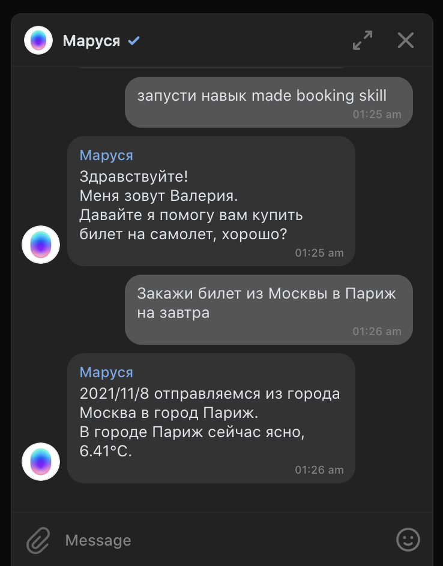

# Домашнее задание №5: Тестирование API-обращений; публикация навыка в Марусе

1. Покрыть тестами новый функционал (запрос погоды по API) учебного чат-бота: написать тест-кейс, используя тег mockData;
2. Развернуть скилл в канале Маруся, в него можно зайти из приложения или капсулы по активационной фразе (пользователям с доступом к скиллу);
 
Пример активации: 
> 
